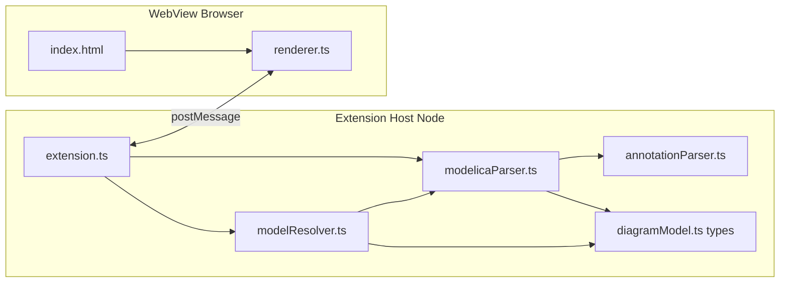

# Modelica Graphical Preview — 技术文档

本文面向维护者与后续接手的自动化代理：说明架构、数据流、关键文件职责，以及**按功能快速定位应修改的源码**。

面向最终用户的使用说明见仓库根目录 [README.md](../README.md)。

---

## 1. 项目定位

| 项 | 说明 |
|----|------|
| 类型 | VS Code 扩展（`package.json` → `main`: `./out/extension.js`） |
| 作用 | 解析当前打开的 **Modelica `.mo` 源码** 中的图形相关 `annotation`，并对组件类型做工作区模型解析（组件引用场景），在 **WebView** 中渲染示意图（非 OpenModelica 级仿真） |
| 技术栈 | TypeScript、esbuild 双入口打包、无 WASM/原生解析依赖 |

---

## 2. 架构与数据流

宿主进程（Node，扩展）读取文本 → 自定义解析器产出结构化 `DiagramModel` → 工作区模型解析器按组件类型补充 `Icon` → `postMessage` 发给 WebView → 浏览器端用 SVG 绘制。



**消息方向概要**

- **宿主 → WebView**：`{ type: 'loading' }`、`{ type: 'update', model: DiagramModel }`、`{ type: 'error', error: string }`
- **WebView → 宿主**：`{ type: 'navigate', componentName?, line? }`（点击组件跳转声明行）

---

## 3. 源码与产物目录

| 路径 | 说明 |
|------|------|
| `src/extension.ts` | 扩展入口：`activate`、命令、WebView 面板生命周期、防抖更新、跳转编辑器 |
| `src/parser/modelicaParser.ts` | 扫描 `.mo`：类名、`annotation` 块、`connect`、组装 `DiagramModel` |
| `src/workspace/modelResolver.ts` | 工作区 `.mo` 索引与组件类型解析；命中后提取被引用模型 `Icon` 图元，补充到组件字段 |
| `src/parser/annotationParser.ts` | `annotation(...)` **括号内**表达式的递归下降解析（记录、数组、字面量等） |
| `src/model/diagramModel.ts` | **宿主与 WebView 共享**的中间模型类型：`DiagramModel`、`Graphic`、`DiagramComponent` 等 |
| `src/webview/renderer.ts` | WebView 内运行的打包脚本：收消息、画 SVG、平移缩放、工具栏 |
| `src/webview/index.html` | WebView 壳：CSP、样式、占位 DOM；构建时复制到 `out/webview/` |
| `esbuild.js` | 双构建：`extension.ts` → `out/extension.js`（cjs + external `vscode`）；`renderer.ts` → `out/webview/renderer.js`（iife） |
| `out/` | **运行与调试时实际加载的构建产物**（不要手改，改 `src/` 后重新 compile） |
| `package.json` | 扩展清单：`contributes.commands` / `languages` / `menus` / `keybindings` |
| `language-configuration.json` | Modelica 语言的基础编辑器配置（括号配对等） |
| `.vscode/launch.json` | F5「Run Extension」；`preLaunchTask` 触发默认 build |
| `.vscode/tasks.json` | 默认构建任务：`npm run compile` |
| `examples/` | 示例 `.mo`，用于手动验证解析与渲染 |

---

## 4. 构建、调试、打包

```bash
npm install
npm run compile    # 生成 out/（含复制 index.html）
npm run watch      # 监听 src 变更
npm run package    # production 构建 + vsce 打 VSIX
```

- **F5**：先执行默认 build，再在 Extension Development Host 中加载本扩展。
- **入口与资源根**：`extension.ts` 中 WebView 的 `localResourceRoots` 指向 `out/`，HTML 内通过占位符注入 `renderer.js` 的 webview URI（见 `buildWebviewHtml`）。

---

## 5. 核心模块说明

### 5.1 `extension.ts`（宿主）

- 注册命令 `modelica-preview.showPreview`。
- 维护全局 `previewPanel`、`currentDocumentUri`；**仅当预览已打开且 URI 匹配**时响应保存/编辑防抖刷新。
- `updatePreview`：`fs.readFileSync` 或传入的内存文本 → `parseModelicaFile` → `WorkspaceModelResolver.enrichModelComponents` → `postMessage`。
- `navigateToComponent`：根据 `line`（1-based）打开文档并 `revealRange`。
- 状态栏项：在 Modelica/`.mo` 活动编辑器时显示快捷入口。

### 5.2 `diagramModel.ts`（契约层）

定义预览所需的全部结构化数据。任何对「图上有什么」的约定变更应**先考虑是否改此文件类型**，再同步：

- 解析侧：`modelicaParser.ts` / `annotationParser.ts` 的抽取逻辑
- 渲染侧：`renderer.ts` 的消费与 SVG 映射

主要字段：`DiagramModel.className`、`diagram` / `icon`（`LayerAnnotation`：`coordinateSystem` + `graphics[]`）、`components[]`（`Placement` + 可选 `resolvedIconGraphics` / `resolutionState`）、`connections[]`（`connect` + `Line`）。

### 5.3 `annotationParser.ts`

解析 `annotation(...)` **内部**字符串为 `AnnotationValue` 树，并提供 `getNum` / `getStr` / `getExtent` / `getRecordArgs` 等辅助函数。  
**不**负责在整文件中定位 `annotation` 关键字（那是 `modelicaParser` 的职责）。

### 5.4 `modelicaParser.ts`

- `findAnnotations`：正则找 `annotation(`，配合 `findBalancedClose` 处理字符串与注释中的括号。
- 根据 `statementPrefix` 与 `Placement` 等推断组件声明行信息。
- `findConnects`：提取 `connect(a, b)` 及可选行内 `annotation`。
- `parseModelicaFile`：**唯一对外导出的解析入口**（`extension.ts` 调用）。

### 5.5 `renderer.ts`（WebView）

- `acquireVsCodeApi().postMessage` / `window.addEventListener('message')`。
- 将 Modelica 坐标映射到固定内部画布（`DIAGRAM_W`×`DIAGRAM_H`），Y 轴翻转；`viewBox` + CSS 实现缩放不变形。
- 图层顺序：声明的 `graphics` → 组件（优先 `resolvedIconGraphics`，否则占位框）→ 连线。
- 工具栏（重置视图、Diagram/Icon 切换）在 **打包脚本** 内绑定（CSP 禁止内联脚本）。
- 滚轮缩放、拖拽平移、双击重置；点击 `.mo-component` 发 `navigate`。

---

### 5.6 `workspace/modelResolver.ts`

- 扫描工作区 `.mo` 文件，建立类名/包名到文件路径的轻量索引。
- 仅处理组件声明引用（如 `B b1`），不处理 `extends` / `import`。
- 解析策略：同目录优先，其次同包优先，再按路径前缀最近匹配；无法稳定判定时标记 `ambiguous` 并回退占位框。
- 通过文件 `mtime` 缓存索引与被引用模型解析结果，降低重复解析成本。

---

## 6. 功能改动速查表

| 目标 | 优先阅读/修改的文件 |
|------|---------------------|
| 新命令、键盘快捷键、菜单、激活条件 | `package.json` → `contributes`；逻辑在 `src/extension.ts` |
| 预览何时刷新、防抖时间、是否跟未保存缓冲区 | `src/extension.ts`（`scheduleUpdate` / `onDidChangeTextDocument` 等） |
| WebView 标题、CSP、静态结构、样式 | `src/webview/index.html`；宿主侧占位符替换 `src/extension.ts` → `buildWebviewHtml` |
| 增加/修正 **annotation 语法**（记录字段、数组、枚举字面量） | `src/parser/annotationParser.ts` |
| 增加/修正 **从整文件提取**（新语句类型、connect 形态、类级注解） | `src/parser/modelicaParser.ts` |
| 调整工作区模型引用解析策略（最近匹配、冲突处理、缓存） | `src/workspace/modelResolver.ts` + `src/extension.ts` |
| 中间数据结构（新图形类型、组件字段） | `src/model/diagramModel.ts` + 同步 parser 与 `renderer.ts` |
| SVG 外观、交互（缩放、图层、某 Primitive 画法） | `src/webview/renderer.ts` |
| 构建产物路径、是否 minify、是否 external vscode | `esbuild.js` |
| TypeScript 严格模式、lib | `tsconfig.json` |
| 调试启动与预构建任务 | `.vscode/launch.json`、`.vscode/tasks.json` |

---

## 7. 设计约束与注意事项

1. **双运行时**：`extension.ts` 为 Node（仅可 `require('vscode')`）；`renderer.ts` 为浏览器，**不能**直接 import `vscode`；共享类型只能通过 `diagramModel.ts` 等纯类型模块，并由 esbuild 分别打入两端。
2. **CSP**：`index.html` 限制了 `script-src`；交互逻辑须放在 `renderer.js`，避免依赖内联脚本。
3. **解析器性质**：基于正则与括号扫描的启发式实现，**非完整 Modelica 语言服务器**；怪异排版或生成代码可能解析失败或静默丢信息。
4. **`out/` 为生成目录**：排查线上行为应以 `src/` 为准；修改后务必 `npm run compile`（或 watch）再 F5。
5. **工作区引用边界**：当前只替换组件声明引用的 Icon；`extends` 与 `import` 解析未实现，命中失败或冲突会回退为占位框。

---

## 8. 扩展方向（供规划参考）

- 更完整的 Modelica 词法/语法或树状 AST（当前为轻量扫描）。
- 多文件 `extends`/导入图形的解析（当前已支持组件声明引用的工作区 Icon 替换）。
- 预览与仿真结果（变量轨迹）联动（需独立数据源，超出当前范围）。
- 单元测试：对 `parseModelicaFile` 与 `parseAnnotationContent` 固定样例做快照或断言（当前仓库以 `examples/` 手工验证为主）。

---

## 9. 关键符号索引

| 符号 / 概念 | 位置 |
|-------------|------|
| `parseModelicaFile` | `src/parser/modelicaParser.ts` |
| `parseAnnotationContent` | `src/parser/annotationParser.ts` |
| `DiagramModel` | `src/model/diagramModel.ts` |
| `modelica-preview.showPreview` | `package.json` + `src/extension.ts` |
| `buildWebviewHtml` | `src/extension.ts` |

---

*文档版本与仓库代码同步维护；若增加新目录或入口，请更新第 3 节与第 6 节表格。*
